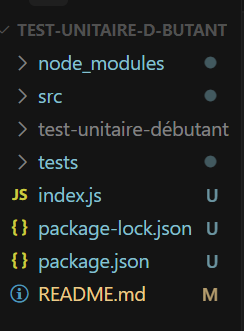
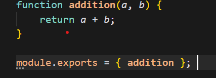
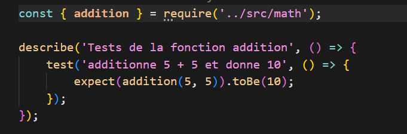
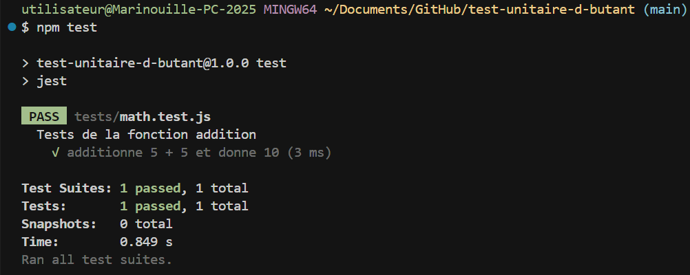

# Test Unitaire Débutant

Ce projet est une introduction aux tests unitaires en JavaScript utilisant Jest.

## Structure du Projet

```


```

## Installation

1. Clonez le repository :
```bash
git clone https://github.com/MarinaFernandezFromMarseille/test-unitaire-d-butant.git
```

2. Installez les dépendances :
```bash
npm install
```

## Configuration

Le projet utilise Jest comme framework de test. La configuration est dans le `package.json` :

```json
{
  "scripts": {
    "test": "jest"
  },
  "devDependencies": {
    "jest": "^29.7.0"
  }
}
```

## Fonctionnalités

### Fonction Mathématique (`src/math.js`)




### Tests Unitaires (`tests/math.test.js`)




### Méthode locale

Pour lancer les tests localement :
```bash
npm test
```

Résultat:




## Apprentissage

Ce projet sert d'introduction aux concepts de base des tests unitaires :
- Structure d'un projet avec tests
- Utilisation de Jest
- Écriture de tests simples
- Organisation du code en modules
- Utilisation de `describe` et `test`
- Assertions avec `expect`

## Auteur

MarinaFernandezFromMarseille

## Licence

ISC